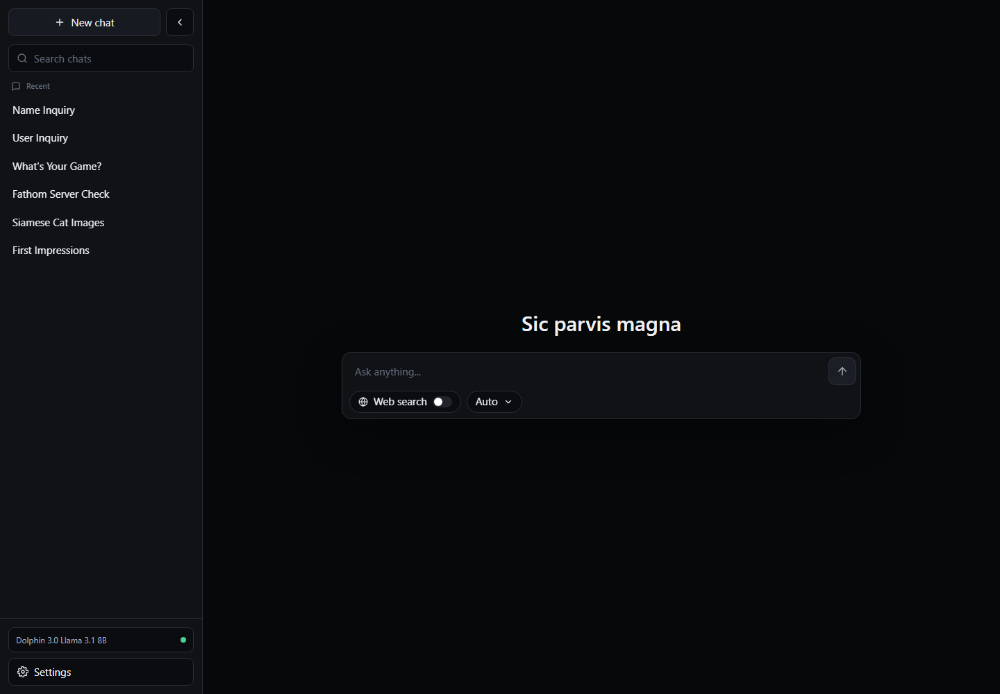
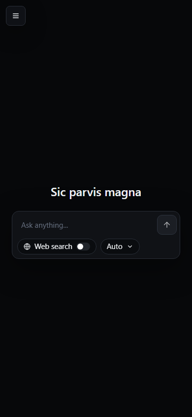

# Bonfire

Bonfire is a private local AI assistant for a single Windows machine.

It runs a real chat UI, a local llama.cpp model server, SearXNG web search, Playwright page reading, SQLite history, prompt presets, local memory, and an optional Tailscale Funnel switch for using it away from the desk.

It is the kind of app you leave running when you want a fast, sharp, local assistant, then shut down when you want the GPU back for games.



## Why This Is Nice

- It is local-first. Chats, settings, memories, and prompt layers live on the machine.
- It streams like a normal modern chat app, not like a terminal bolted to a model.
- Web search uses local SearXNG, reranks query variants, reads top pages, and can show image results.
- Prompt modes are editable. General, Coding, and NSFW are built in, and custom presets can be added.
- Tailscale Funnel is a setting, not a permanent accident. Turn it on when you need remote access, off when you do not.
- Shutdown is in the UI. Settings -> Status -> Shut down Bonfire stops the backend, frontend, model server, SearXNG, and Funnel routes.



## The Shape Of It

Bonfire is four local services and one local database:

| Piece | Tech | Port |
|---|---|---|
| Model server | llama.cpp with Vulkan GPU offload | `127.0.0.1:8080` |
| Search | SearXNG in Docker | `127.0.0.1:8888` |
| API | FastAPI | `127.0.0.1:8000` |
| UI | Vite + React | `127.0.0.1:3000` |
| Storage | SQLite + ChromaDB files | `backend/data/` |

The frontend talks to the local backend when opened at `127.0.0.1` or `localhost`. When opened through the Tailscale hostname, it targets the public Funnel backend URL on port `8443`.

## Hardware And Model

This setup was built around:

- GPU: AMD RX 6600 XT, 8 GB VRAM
- Backend model: Dolphin 3.0 Llama 3.1 8B GGUF, Q4_K_M
- Inference runtime: llama.cpp built with `-DGGML_VULKAN=ON`
- Default context: `8192`
- Default GPU layers: `999`
- Observed generation: roughly 50 tokens/sec with full GPU offload on this machine

The model file is intentionally not committed. Put GGUF files in `models/` and point `scripts/start-llama.ps1` and `scripts/start-all-and-wait.ps1` at the file you want.

## Web Search

The search path is local and provider-flexible because SearXNG sits in front of the engines.

Bonfire does more than forward a raw query:

- strips chatty search phrasing before querying
- creates a small set of query variants
- requests web and image categories separately when visuals are useful
- canonicalizes URLs and removes tracking params
- dedupes repeated hits
- reranks locally using query overlap, title/domain matches, upstream score, and engine agreement
- reads top web pages with Playwright before prompting the model
- keeps image results as visual references instead of treating filenames as facts

Useful `.env` knobs:

```env
MAX_SEARCH_RESULTS=5
MAX_PAGES_TO_READ=2
SEARCH_QUERY_VARIANTS=3
SEARCH_IMAGE_RESULTS=6
SEARCH_SAFESEARCH_DEFAULT=0
SEARCH_LANGUAGE=auto
SEARCH_TIMEOUT_SECONDS=15
```

## Prompting And Memory

Bonfire always builds prompts in layers:

1. Core Bonfire behavior
2. Runtime context
3. Active preset or custom behavior layer
4. User-editable guardrails
5. Relevant memory
6. Web/page context when search is enabled
7. Recent conversation history

The built-in presets are:

- General: default assistant behavior
- Coding: terse, pragmatic engineering answers
- NSFW: adult creative and frank discussion mode

Memory is backed by SQLite plus ChromaDB. The UI exposes memory creation, search, deletion, and a small knowledge graph under Settings -> Memory.

## Tailscale Funnel

Funnel is optional and saved in Bonfire settings.

When enabled in Settings -> Status:

- `https://riebeck.tail4fc8a6.ts.net` proxies to the frontend on `127.0.0.1:3000`
- `https://riebeck.tail4fc8a6.ts.net:8443` proxies to the backend on `127.0.0.1:8000`

This exposes the app to the public internet with no app-level password gate. Leave Funnel off when you only want local access.

The launcher reapplies the saved setting on startup, so if Funnel is off in the UI, it stays off next time.

Manual checks:

```powershell
tailscale funnel status
.\scripts\apply-funnel-setting.ps1
.\scripts\set-funnel.ps1 -Enabled true
.\scripts\set-funnel.ps1 -Enabled false
```

## Run

The easiest path is the desktop shortcut:

```bat
C:\Users\mshah\OneDrive\Desktop\Bonfire.bat
```

That runs:

```powershell
.\scripts\start-all-and-wait.ps1
```

It will:

1. refresh PATH from the registry
2. start Docker Desktop if needed
3. start SearXNG with Docker Compose
4. start llama.cpp
5. start the FastAPI backend
6. start the Vite frontend
7. apply the saved Funnel setting
8. print local and Funnel status

Open:

```text
http://127.0.0.1:3000
```

For separate visible service windows:

```powershell
.\scripts\start-all.ps1
```

## Stop

From the UI:

```text
Settings -> Status -> Shut down Bonfire
```

From PowerShell:

```powershell
.\scripts\stop-all.ps1
```

The shutdown path turns off Funnel routes, stops the backend, then the frontend, then llama.cpp, then SearXNG.

## Setup Notes

Prerequisites used by this setup:

- Git
- Python 3.12
- Node.js LTS
- Docker Desktop with WSL2 backend
- Visual Studio Build Tools for C++
- CMake + Ninja
- Vulkan SDK
- Tailscale, only if Funnel is desired

The backend uses a local virtual environment in `backend/.venv/`. The frontend uses npm in `frontend/`.

Backend environment example:

```env
LLAMA_BASE_URL=http://127.0.0.1:8080
SEARXNG_BASE_URL=http://127.0.0.1:8888
DATABASE_PATH=./data/app.db
HOST=127.0.0.1
PORT=8000
CORS_ORIGINS=http://127.0.0.1:3000,http://localhost:3000,https://riebeck.tail4fc8a6.ts.net
```

## Replacing The Model

1. Download a GGUF model into `models/`.
2. Update `$modelPath` in `scripts/start-llama.ps1`.
3. Update `$modelPath` in `scripts/start-all-and-wait.ps1`.
4. Restart Bonfire.

If the model does not fit in VRAM, lower one of these before starting:

```powershell
$env:LLAMA_CTX_SIZE = "4096"
$env:LLAMA_GPU_LAYERS = "60"
```

## Testing

Backend:

```powershell
cd backend
.\.venv\Scripts\python.exe -m unittest discover tests
```

Frontend:

```powershell
cd frontend
npm run build
npx playwright test
```

The Playwright tests run against the real local stack. Start Bonfire first.

## Useful Checks

```powershell
docker ps
Invoke-RestMethod "http://127.0.0.1:8888/search?q=test&format=json"
Invoke-RestMethod "http://127.0.0.1:8000/health"
Invoke-RestMethod "http://127.0.0.1:8080/health"
tailscale funnel status
```

If SearXNG returns HTML instead of JSON, check `infra/searxng/settings.yml` and make sure `json` is listed under `search.formats`.

## Known Sharp Edges

- Single-user by design.
- Funnel is public internet exposure when enabled.
- Search quality still depends on upstream SearXNG engines and rate limits.
- Page reading can fail on login walls, CAPTCHAs, and heavy bot protection.
- The model file, local database, `.env`, logs, and generated builds are intentionally ignored by git.
- Conversation history and settings are stored unencrypted in `backend/data/`.

## Repo Layout

```text
bonfire/
├── backend/        FastAPI app, prompt assembly, search, memory, settings
├── frontend/       Vite + React chat UI and Playwright tests
├── infra/          Docker Compose and SearXNG settings
├── models/         Local GGUF files, ignored by git
├── scripts/        Windows startup, shutdown, Docker, Funnel helpers
├── docs/           README screenshots
└── vendor/         Local llama.cpp checkout/build, ignored by git
```
