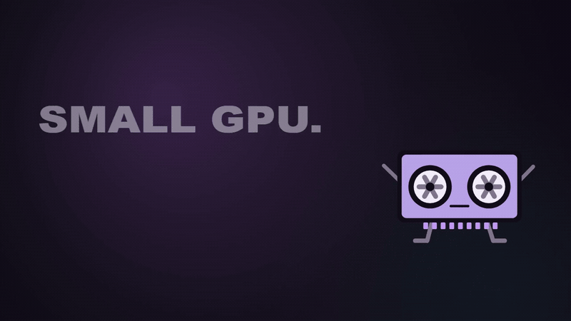
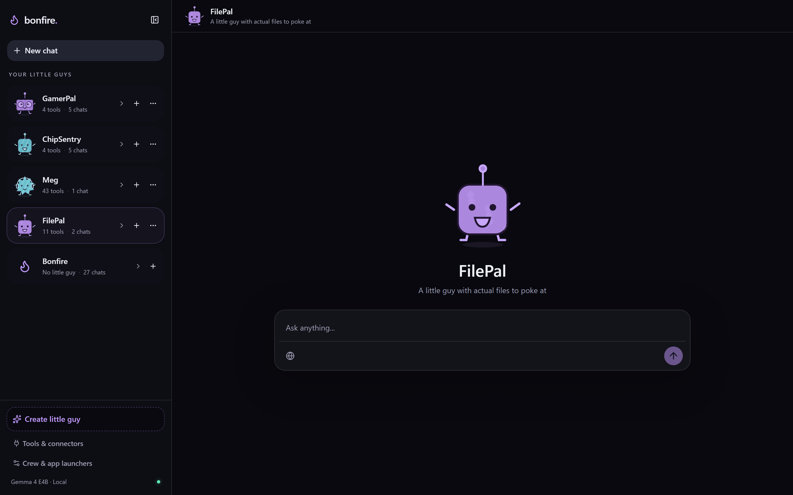

# Bonfire

[](https://github.com/shahwaizse/bonfire/blob/main/docs/bonfire-intro.mp4)

[Watch the 24-second film with sound](https://github.com/shahwaizse/bonfire/blob/main/docs/bonfire-intro.mp4) / [the whole thing is code](motion/)

Bonfire is my playground for learning **edge computing, self-hosting LLMs, and giving small models actual tools**. It runs a local model on a Windows desktop, wraps it in a chat app, and occasionally lets it venture onto the internet. Experimental software: use at your own risk. Expect rough edges and questionable little guys.

## What it does

- Streams local chat, code and explanations through **Gemma 4 E4B + llama.cpp**.
- Keeps conversations in SQLite, with rename/delete and saved tool activity.
- Creates custom **little guys** with locally generated modular mascots, instructions and specific tool/app permissions.
- Launches configured Windows apps or Steam games through an explicitly assigned MCP tool.
- Gives machine-watcher little guys real Windows/AMD GPU readings and recorded llama.cpp inference speeds.
- Runs native structured **MCP tool calls**, validates arguments, feeds back real results, and shows collapsible traces.
- Searches **Tavily, then Brave** using free-only accounts and persistent request caps.
- Reads supplied web pages and provides numbered source citations.
- Lets the agent call **image search** and display an inline gallery. No Images mode; ask naturally.
- Includes a repeatable local model bake-off and a separate search-routing experiment.



## The stack

| Piece | What runs | Default |
| --- | --- | --- |
| Model | Gemma 4 E4B Instruct Q4_K_M / llama.cpp / Vulkan | `127.0.0.1:8082` |
| Backend | Node.js, Express, official MCP SDK | `127.0.0.1:8000` |
| Frontend | React, Vite, Tailwind | `127.0.0.1:3000` |
| History | SQLite | `backend/data/app.db` |
| Search quotas | Separate persistent SQLite ledger | `backend/data/search-usage.db` |
| Web + pictures | Tavily -> Brave | Optional hosted APIs |
| MCP | Local stdio and remote Streamable HTTP, explicit tool permissions | Shared folder / connected services |

Inference stays local. Search queries go to the selected hosted provider; page reads contact the requested site; gallery images load from their public hosts. Docker, SearXNG and a paid inference API are not required.

## Start here

This repo's launchers target **Windows + PowerShell**. My current machine is a Ryzen 5 3600, Radeon RX 6600 XT (8 GB), and 16 GB RAM. That is a measured setup, not a hardware compatibility guarantee.

### 1. Prepare the model runtime

Have Node.js, Git and a Vulkan-capable GPU/driver available. To build llama.cpp locally, install CMake, Ninja, Visual Studio C++ Build Tools and the Vulkan SDK. Clone/build llama.cpp under `vendor/llama.cpp` so its server is at:

```text
vendor/llama.cpp/build/bin/llama-server.exe
```

Use a llama.cpp build with Jinja/native tool calling and the chosen model's architecture support. Local binaries and GGUFs are not committed.

The [download script](scripts/download-bakeoff-models.ps1) downloads pinned Qwen and Gemma benchmark files to **D:** with resume and hash verification:

```powershell
.\scripts\download-bakeoff-models.ps1
```

It downloads both candidates (about 10.66 GB combined), not just the app model. Default app path:

```text
D:\Projects\bonfire-models\gemma-4-E4B-it-Q4_K_M.gguf
```

Set `BONFIRE_MODEL_PATH` before launching to use a different location. Shared launch settings are in [model-settings.ps1](scripts/model-settings.ps1): 8192 context, one inference slot, native Jinja tool calls and thinking off. The RX 6600 XT profile uses Flash Attention, a 1024 batch / 128 microbatch, full SWA cache and a bounded 512 MiB host prompt cache. `LLAMA_CTX_SIZE`, `LLAMA_GPU_LAYERS`, `LLAMA_BATCH_SIZE`, `LLAMA_UBATCH_SIZE`, `LLAMA_CACHE_RAM`, `LLAMA_THREADS`, `LLAMA_FLASH_ATTN` and `LLAMA_SWA_FULL` override those defaults. Startup warms common prefixes without executing tools; set `BONFIRE_WARMUP=false` in the backend configuration to disable it. See the [performance report](docs/performance-optimization-2026-10-01.md) for measurements and tradeoffs.

### 2. Install the app

```powershell
cd backend
npm ci
Copy-Item .env.example .env   # first setup only
cd ..\frontend
npm ci
cd ..
```

Configure `backend/.env`; the launchers also create it from the example if missing. Local chat works without search keys. Frontend requests default to `http://127.0.0.1:8000`; set `VITE_BACKEND_URL` in ignored `frontend/.env.local` if needed.

### 3. Prepare the shared MCP folder

```powershell
New-Item -ItemType Directory -Force D:\Projects\bonfire-mcp
```

Place a few UTF-8 learning notes there. The built-in MCP server exposes `list_files` and `read_file` for that folder. Override `BONFIRE_MCP_ROOT` in the backend configuration for another dedicated directory. This is not access to your whole computer.

### 4. Run

```powershell
.\scripts\start-all-and-wait.ps1 -NoWait
```

Open **http://127.0.0.1:3000**. Services start in the background. Omit `-NoWait` for the launcher's Enter-to-close status window, or use `start-all.ps1` for separate service windows.

Stop Bonfire with:

```powershell
.\scripts\stop-all.ps1
```

## Give the little guy something to do

> Explain how an edge device differs from a cloud server.

> Use the workspace tools to list files, read my learning notes, and summarize them.

> Show me pictures of auroras over Norway.

> More pictures from the same place, please.

> With Web enabled: check the latest llama.cpp release and cite your sources.

The model decides when to call **`search_images`**. Image search works with Web off, returns actual results, and places the gallery underneath the model's reply. It receives metadata rather than image pixels: this does not enable vision.

**Web remains a manual search override.** When on, Bonfire prefetches text evidence for changing facts or explicit verification; timeless questions skip that extra request. The agent can search/read further. Supplied links can be read with Web off. Picture requests skip the text prefetch. The [earlier routing experiment](docs/search-tool-routing-2026-09-30.md) and [current performance report](docs/performance-optimization-2026-10-01.md) document the model's routing limits. Web is still controlled by the toggle and each guy's permissions.

## Your little guys

Your crew lives in the **left sidebar**. Each little guy has a compact chat group; expand one to see its chats in a simple list. Collapse the whole sidebar into a mascot rail, then click a mascot to reveal its chats. **Bonfire** keeps general chats in a separate group. Sidebar/group states are remembered locally. Saved chats have UUIDs in their URLs, so reloading restores the selected conversation and its little guy.

Click **Create little guy** at the bottom of the sidebar to open the creator directly. Describe a job, choose a shape/color/personality (or ask for a surprise), and let the local model call `create_little_guy`. The result is a validated recipe for GPU, flame, blob, star or robot assets, with modular eyes, mouth, accessory and pattern. Palette/seed variations make them distinct without asking the model to write SVG or using a hosted image generator.

Edit the name and instructions, check the tools it may use, assign any app launchers, then save. Use **+** beside a guy to start its chat; the top **New chat** button starts a Bonfire chat. A bare page load opens Bonfire; a URL with `?chat=...` restores that chat. Each saved conversation retains its guy. Use a guy's menu to edit it, or **Crew & app launchers** to manage the crew. Permissions are enforced by the backend and native tool catalog, with web search and page reading included for every guy, not just written into a prompt. Remaking a saved character's mascot preserves its name, instructions and permissions.

**App launchers** accepts a full local Windows `.exe` path or a Steam app ID. Notepad is included on Windows; other apps are configured by the owner. A guy with `desktop__launch_app` may launch only its assigned IDs, without an extra confirmation each time. The model cannot supply executable paths, arguments or shell commands. A launch result means the request was sent; it does not verify that a window opened. Default Bonfire chat has no desktop-launch tools.

Guys live in the ignored chat database; app configurations live in ignored `backend/data/desktop-apps.json`. See [the little-guys guide](docs/little-guys.md) for examples and boundaries.

**Local files:** add existing folders under **Tools & connectors → Local folders**, then select **Local files** tools and assign read-only or read/write folders in a guy's editor. Guys can browse, read, find filenames, create text files/folders, make exact edits and restore previous file versions. Writes check the current file hash, use the official MCP filesystem atomic-write primitive, and save backups on D: by default. Assigned writes run without a confirmation popup. The optional **run command** tool executes Bash from an assigned writable folder; shell access runs under your OS account and is not confined to that folder. See [setup, tools and recovery](docs/filesystem-tools.md).

For a **machine watcher**, assign `machine__get_machine_snapshot` and `machine__get_inference_stats` (or the combined `machine__get_status` tool). Guys with both existing tools also get the combined read automatically. Ask "How hot is my GPU, and how fast were recent model turns?" The tools read AMD edge/hotspot temperatures, GPU activity/VRAM, CPU load/RAM and actual llama.cpp tokens/sec. A persistent Windows helper samples every five seconds; readings include timestamps and age, and samples older than 15 seconds are rejected. Unsupported readings are unavailable. See [measurement details](docs/little-guys.md#watch-the-machine).

## Free-only search

Use dedicated [Tavily](https://www.tavily.com/pricing) and/or [Brave Search API](https://api-dashboard.search.brave.com/) accounts configured to prevent paid usage. Keep Tavily on its free plan with paid usage disabled; keep Brave's paid spending limit at $0 and automatic reload disabled. Check current account terms and dashboard settings before confirming them in Bonfire.

In ignored `backend/.env`:

```env
TAVILY_API_KEY=
TAVILY_FREE_ONLY_CONFIRMED=false
BRAVE_SEARCH_API_KEY=
BRAVE_FREE_ONLY_CONFIRMED=false
TAVILY_MONTHLY_LIMIT=1000
BRAVE_MONTHLY_LIMIT=1000
```

Set the confirmation flags to `true` only after checking the provider restrictions. Restart the backend after configuration changes. Text and image requests share the same counters. Basic Tavily search disables automatic upgrades; quota exhaustion, temporary failures and missing results can fall back to Brave. Bonfire reserves requests before sending them, counts failures conservatively, and retains counters/cooldowns across restarts and cleared chats. Limits can be reduced to zero.

**The local ledger cannot enforce billing settings on an external account.** Provider-side restrictions are required to prevent spending, especially if a key is also used elsewhere. Bonfire does not enable billing or buy credits. Do not delete `search-usage.db` to reset quotas. If both providers are unavailable, search fails honestly; local chat can continue. Direct page reads consume no search-provider credits. Running your own hardware still uses electricity.

The complete runtime settings are in [backend/.env.example](backend/.env.example). Real keys, private configuration, chat databases and model files stay out of Git.

## MCP: real tools, small scope

The [filesystem and Bash benchmark](docs/filesystem-benchmark-2026-10-02.md) records actual app tests: 22/22 filesystem corpus cases passed after read/edit improvements, while autonomous website startup still failed and needed explicit command guidance. It includes latency, tool execution metrics and the runnable demo.

The [shared harness improvements](docs/harness-improvements-2026-10-02.md) add managed app lifecycle commands, compact tool evidence across chat turns, configured folder context and error recovery for any little guy with the corresponding tools.

The [MCP guide](docs/mcp-tools.md) covers adding local stdio servers using ignored `backend/mcp.json` and the [example config](backend/mcp.example.json). Tools require an explicit allowlist and read-only annotations; arguments are validated, dependent calls execute in order, and loops/results have limits. The included workspace server blocks paths escaping its root and limits UTF-8 reads to 24 KB.

MCP annotations are not an operating-system sandbox. Inspect servers before allowing them. Remote HTTP MCP connects through [Tools & connectors](docs/remote-mcp.md). MCP image/resource blocks are not implemented. Local non-read-only MCP tools need a separate per-tool `allowSideEffects` opt-in in the MCP server configuration; the built-in desktop launcher is the first example. Native filesystem and Bash tools use per-guy assignments instead. Code generation in chat is available independently of file-write permissions.

## Which local model?

The [bake-off](backend/bench/README.md) uses 16 deterministic tool tasks, three repetitions, native templates and auditable traces. It runs separately on port **8081**.

| Candidate | Passed attempts, thinking off | Outcome on this machine |
| --- | --- | --- |
| Dolphin3.0 Llama3.1 8B | 24/48 | Original baseline; inconsistent tool use |
| Qwen3.5-9B | 48/48 | Slower, stronger tool use; retained locally |
| Gemma 4 E4B | 42/48 | Current default for hands-on use; faster, less consistent |

These are small fixture-based local measurements, not a universal intelligence ranking. [Full results and trade-offs](docs/tool-calling-bakeoff-2026-09-30.md).

```powershell
.\scripts\run-bakeoff.ps1 -Repeat 3
# Search selection experiment, with the app model running:
cd backend
node bench/search-routing.js
```

The search-routing experiment uses real inference with deterministic provider outputs and spends no search credits. Neither benchmark requires a cloud LLM key. Gemma is local; Gemini is a different hosted model family.

## Development checks

```powershell
cd backend
npm test
cd ..\frontend
npm run build
npx playwright install chromium  # once, for browser checks
npx playwright test
```

Live browser checks require the backend and model on their default ports; live picture tests also need configured free search. Some tests use deterministic mocks. See [MCP integration](docs/mcp-integration-2026-09-30.md), [image search](docs/image-search.md), and [routing validation](docs/search-tool-routing-2026-09-30.md) for the scope of recent checks.

```powershell
Invoke-RestMethod http://127.0.0.1:8000/health
Invoke-RestMethod http://127.0.0.1:8000/tools
Invoke-RestMethod http://127.0.0.1:8082/health
```

## Things to try next

- **Telemetry history:** build on the machine watcher with background sampling and charts comparing idle, gaming and inference sessions.
- **Learning-note retrieval:** search small local documents with citations and line numbers.
- **Experiment memory:** put benchmark runs in SQLite and let a bounded tool compare them.
- **Smaller-model sprint:** measure Qwen 4B against 9B for tool accuracy and end-to-end latency.
- **A second edge node:** explore LAN tool servers and measure the network penalty.

## Repo map

```text
backend/    API, native tool loop, MCP, search, SQLite, model benchmarks
frontend/   React chat UI and desktop/mobile browser checks
motion/     Code-only film, synth soundtrack and reproducible export
scripts/    Windows launchers, downloads, benchmark orchestration, cleanup
docs/       Film exports, screenshots and experiment reports
models/     Old local model files (ignored)
vendor/     Local llama.cpp checkout/build (ignored)
```

The old SearXNG/Docker dependency, WhatsApp bridge, prompt presets, settings panel, browser shutdown controls and sidebar folders were removed. The optional [SearXNG cleanup script](scripts/remove-searxng.ps1) removes only the identified old Bonfire container and does not uninstall Docker.

## The extremely serious marketing department

The header film is made entirely with Canvas code and a generated synth beat. [Preview, source and export instructions](motion/README.md). No stock footage, paid assets or image generators; just a GPU with legs and a concerning amount of confidence.

### Remote MCP connectors

Open **Tools & connectors** in the left sidebar to add any MCP server URL, enable specific tools, and assign them to a little guy. There are no built-in connector presets. Bonfire supports remote Streamable HTTP MCP servers with OAuth, bearer tokens or no authentication. Credentials are encrypted locally for your Windows account. Notion AI tools are excluded for free-only usage. See [connector setup and limitations](docs/remote-mcp.md).
